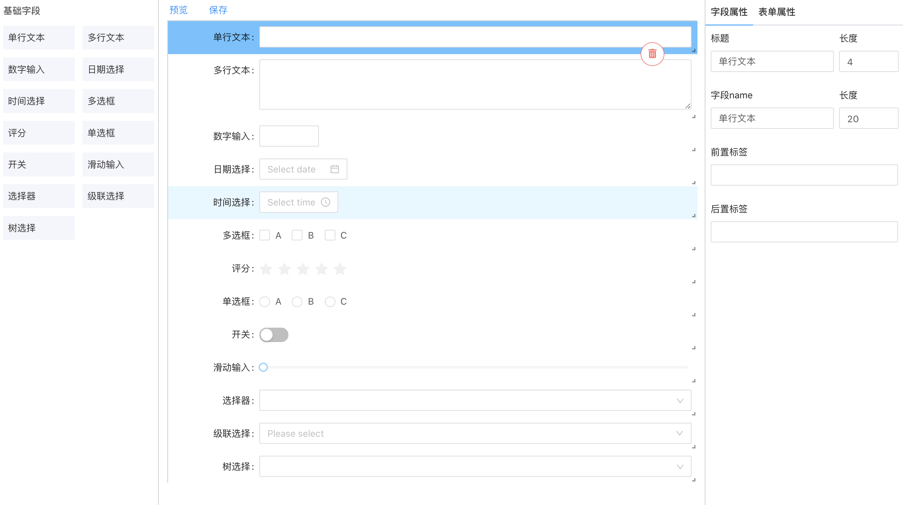

# react-form-editor

> Made with create-react-library

[](https://www.npmjs.com/package/react-form-editor) [](https://standardjs.com)

## Still In Working Progress

## Example
[https://FaberSober.github.io/react-form-editor](https://FaberSober.github.io/react-form-editor)

Form Edit Panel


Form Show Panel


## Install

```bash
npm install --save react-form-editor
```

## Usage

```jsx
import React, { Component } from 'react'

import FormEditPanel from 'react-form-editor'
import 'react-form-editor/dist/index.css'

class Example extends Component {
  render() {
    return <FormEditPanel />
  }
}
```

## Export Form JSON
```
[
  {
    id: 'abcdefgh', // 8位随机字母ID
    type: 'Input', // form组件类型
    label: '单行文本', // form组件Label标签
    layout: { w: 12, h: 1 } }, //  组件布局（网格布局，分为12格）：w-宽/h-高
    options: [
      { label: 'A', value: 'A' },
    ], // 多选组件候选项
    properties: {

    }, //  组件补充配置属性
  },
]
```

## License

MIT © [FaberSober](https://github.com/FaberSober)
